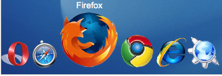

<div align="center"></div>
<h1 align="center">FISH EYE MENUS</h1>

## Description
This project shows the application of Fish Eye menu. All the menu items are displayed on the user interface at once. When a menu item is pointed or clicked at, it becomes “larger” compared with the rest of the menu items.

## Running
Install the packages:
```bash
npm install
```

Start the application:
```bash
npm start
```
